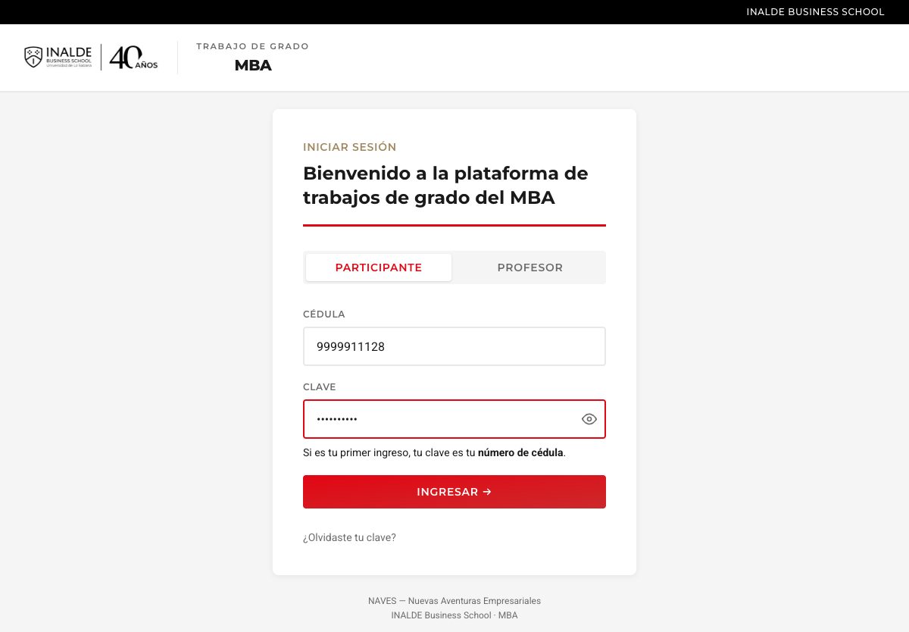
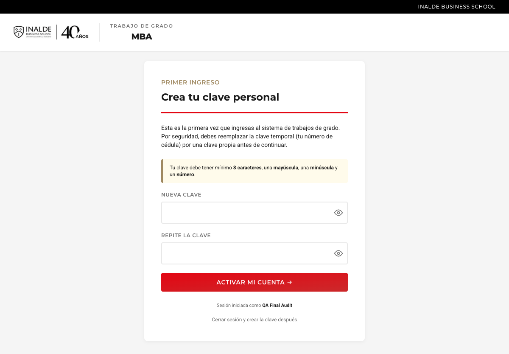
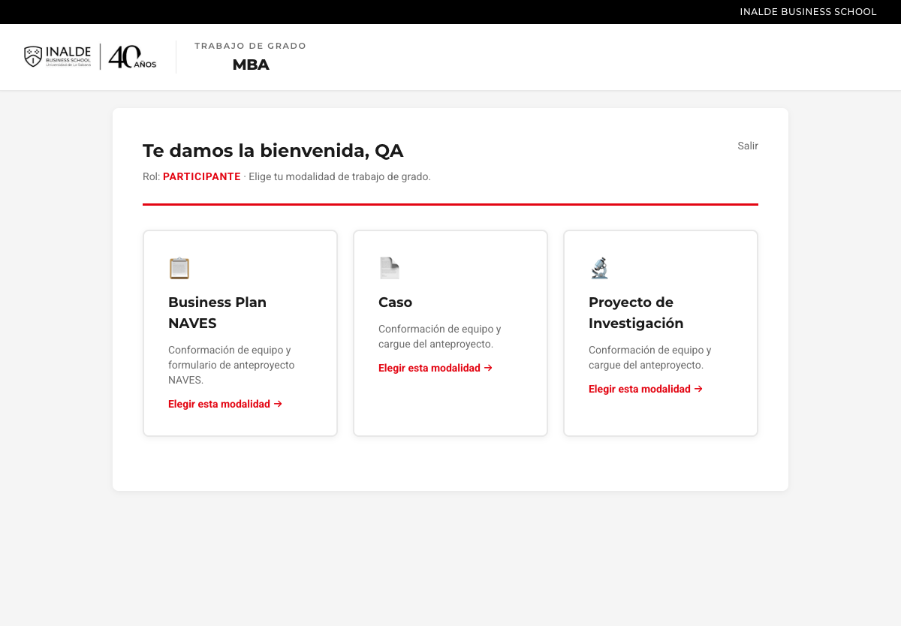
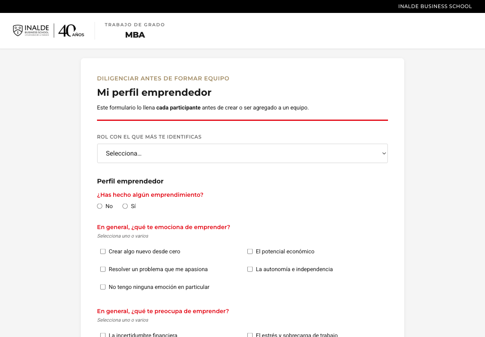
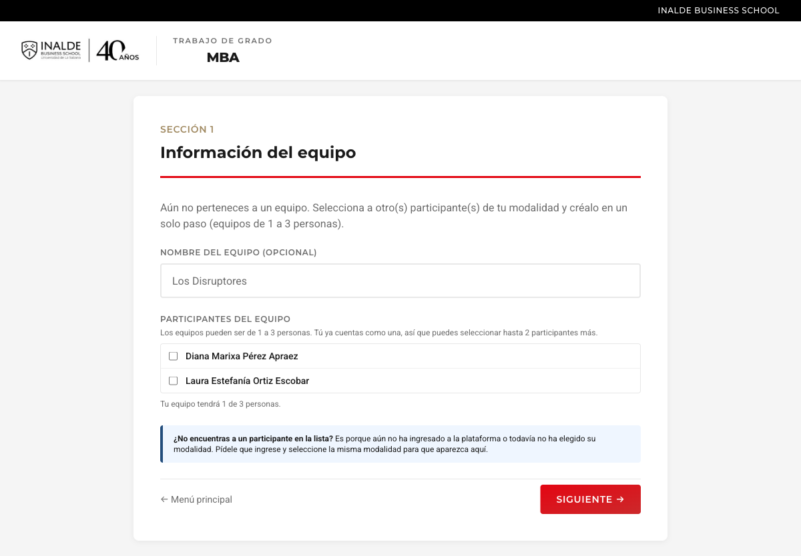
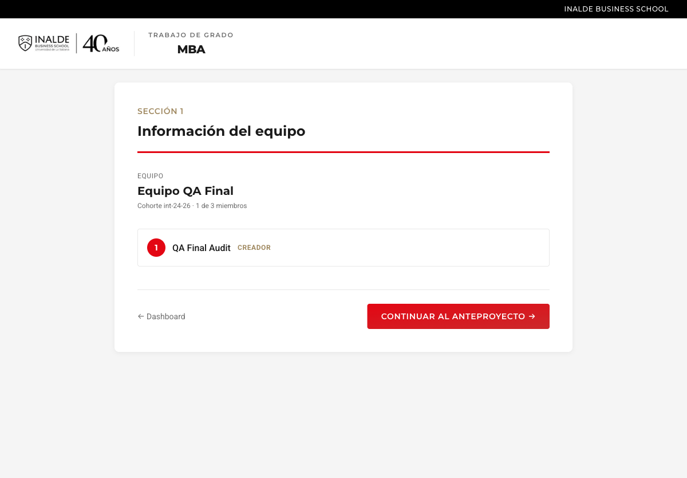
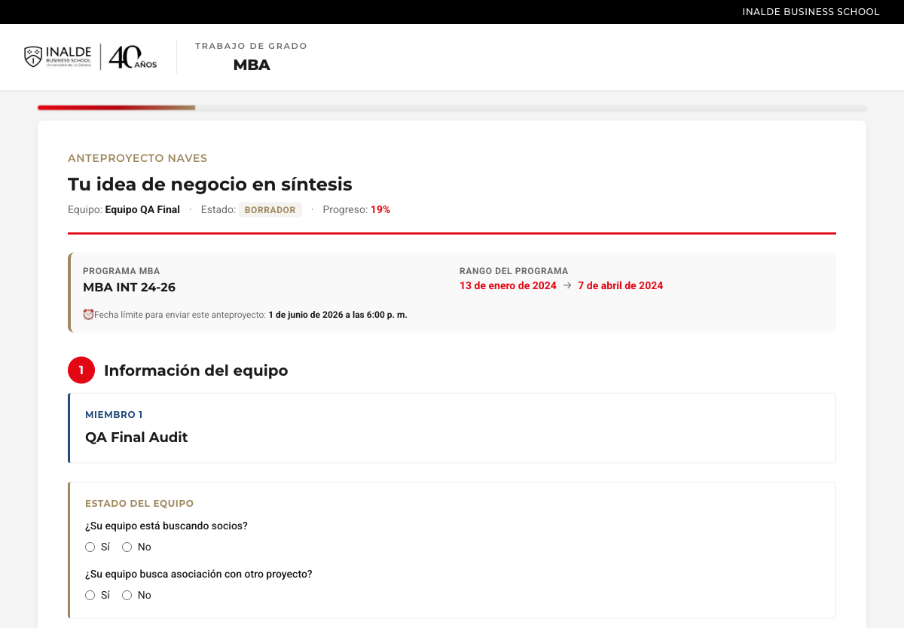
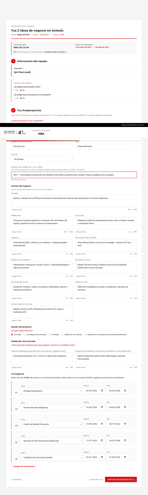
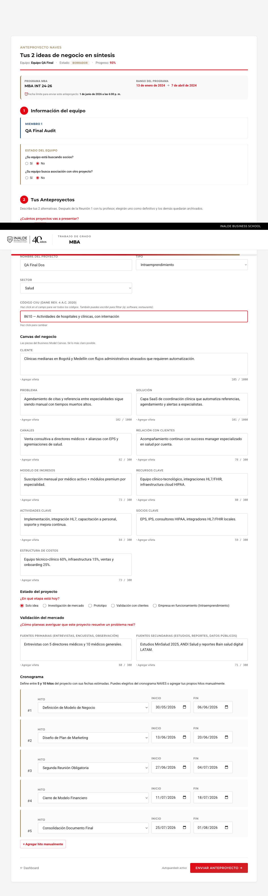
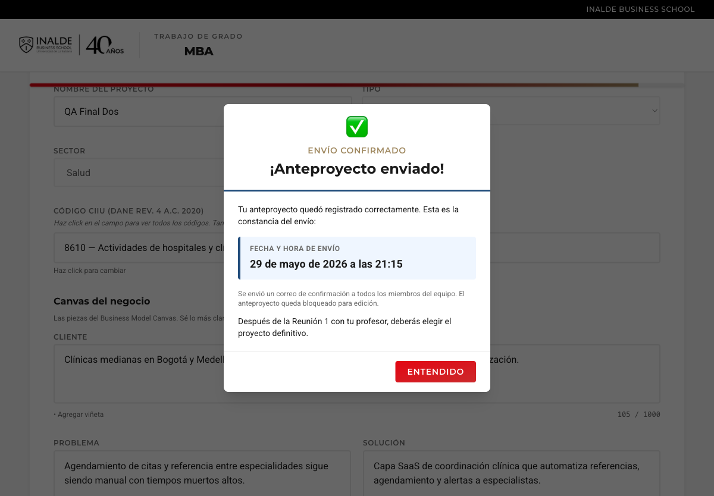

# Auditoría QA exhaustiva — Plataforma NAVES

**Cliente:** INALDE Business School — Programa MBA
**Proyecto:** NAVES (New Business Adventures)
**Fecha:** 30 de mayo de 2026

---

## 1. Reportes que originaron esta auditoría

Recibimos tres reportes consistentes de participantes y del administrador:

- **R1.** Al tocar "Enviar anteproyecto", el sistema se queda en "Procesando…" y solo logra enviar después de refrescar la página.
- **R2.** En el login, el botón "Ingresar" queda como "INGRESANDO…" y solo entra después de refrescar.
- **R3.** Dentro del panel admin (por ejemplo `/admin/cohortes`) la pantalla se queda en "Cargando…" indefinidamente.

---

## 2. Diagnóstico de causa raíz

Tras hacer pruebas de latencia a todos los endpoints del backend (todos responden en menos de 1.5 s) y revisar el código del frontend, encontramos la **causa raíz común** de los tres reportes:

El interceptor de Axios del frontend hacía esta llamada en **cada request** al backend:

```ts
api.interceptors.request.use(async (cfg) => {
  const { data } = await supabase.auth.getSession();   // ← await async
  if (data.session?.access_token) cfg.headers.Authorization = ...
  return cfg;
});
```

`supabase.auth.getSession()` es una operación asíncrona que **puede colgar** si supabase-js está refrescando el token internamente, si la red oscila, o si Supabase Auth tiene un mal momento. Como **todo** request del frontend pasaba por ese `await`, cualquier ventana de Supabase lento se traducía en:

| Síntoma reportado | Por qué ocurría |
|---|---|
| "INGRESANDO…" se queda (R2) | `verificar-cedula` esperaba a `getSession()` antes de salir. |
| "Cargando…" en /admin/cohortes (R3) | El GET de cohortes esperaba a `getSession()`. |
| "Procesando…" al enviar (R1) | El POST `/enviar` esperaba a `getSession()`. |

---

## 3. Fixes aplicados

### Fix raíz — Login, Logout y páginas internas dejan de quedarse "cargando…"

Los tres síntomas (R1, R2, R3) tenían **la misma causa raíz** y se corrigieron con un solo cambio estructural:

- **Login** — el botón "INGRESANDO…" ya no se queda atascado. El call `verificar-cedula` ya no espera al `getSession()` de Supabase.
- **Logout** — el `signOut()` ya limpia el cache de token inmediatamente y hace `window.location.href = '/login'` aunque el revoke del lado del servidor falle. Antes el estado podía quedar a medias.
- **Páginas internas del admin** (`/admin/cohortes`, `/admin/anteproyectos`, etc.) — ya no se quedan en "Cargando…" indefinido. Cualquier GET del frontend es independiente de la latencia de Supabase Auth.

**Cambios técnicos exactos:**

- Nuevo módulo `frontend/src/auth/token.ts` con un cache en memoria del `access_token`.
- `auth/store.ts` actualiza el cache en `init()`, en cada `onAuthStateChange`, y lo limpia en `signOut`.
- `lib/api.ts` interceptor lee del cache de forma **síncrona**. **Cero dependencia** de Supabase Auth para mandar requests al backend.
- `init()` de la app aplica `Promise.race` con timeout de 5 s contra `getSession()`. Si Supabase está lento al arrancar la app, cae a "sin sesión" en lugar de quedarse en pantalla blanca indefinidamente.

### Optimización del envío

Antes el POST `/enviar` tomaba ~16 segundos para 2 proyectos con sus hitos por culpa de round-trips serializados a Supabase. Aplicado:

- **`persistirBorradorEnBD()`** (función compartida entre PUT borrador y POST envío):
  - Saltea el loop de miembros si el payload no trae cambios de perfil/emociones.
  - Update de flags del equipo y SELECT proyectos existentes en paralelo (`Promise.all`).
  - **BATCH INSERT** de todos los proyectos en una sola query.
  - **BATCH INSERT** global de todos los hitos en otra sola query.
  - `fecha_actualizacion` en fire-and-forget (no bloquea respuesta).
- **PUT y POST `/enviar`** cargan contexto (anteproyecto + miembro + CIIUs) en paralelo con `Promise.all`. Antes eran 3-4 round-trips serializados antes de cualquier trabajo real.

### Otros ajustes acumulados durante la auditoría

- Indicador junto al botón Enviar simplificado a un único texto **"Autoguardado activo"** (antes alternaba entre "Guardando…", "✓ Guardado automáticamente" y "⚠ Reintentando guardar…", lo que confundía a los participantes).
- Botón "Guardar borrador" eliminado del formulario para no competir con el envío.
- Calendario de fechas de hitos sin bloqueo nativo (`min` removido del `<input type="date">`). Antes Natalia Patarroyo reportó que las flechas para avanzar de mayo a junio no funcionaban porque el navegador deshabilitaba meses enteros.
- POST `/enviar` ahora es **autosuficiente**: recibe el payload completo en el mismo request en lugar de hacer PUT seguido de POST. El envío ya no depende de que el último autoguardado haya llegado.

---

## 4. Pruebas end-to-end con Playwright (paso a paso)

Recreamos el flujo completo de un participante real con Playwright en producción (`www.naves-inalde.com`). Capturamos screenshot de cada paso del proceso.

### Paso 1 — Pantalla de login

El participante entra a la URL pública y ve el formulario.


### Paso 2 — Login con cédula y clave

Llena cédula (`9999911128`) y clave inicial (la misma cédula).



### Paso 3 — Crear clave personal

Como es primer ingreso, el sistema le pide reemplazar la clave temporal por una propia.



### Paso 4 — Elegir modalidad

El dashboard muestra las tres modalidades. El participante elige Business Plan (decisión irreversible con confirmación).



### Paso 5 — Perfil emprendedor

Antes de formar equipo, llena el perfil emprendedor: rol, emprendimientos previos, emociones y preocupaciones.



### Paso 6 — Formar equipo

Indica el nombre del equipo (opcional) y elige miembros disponibles. En esta prueba creamos un equipo de 1 persona.



### Paso 7 — Equipo confirmado

El equipo queda registrado y se habilita el botón para continuar al anteproyecto.



### Paso 8 — Anteproyecto en blanco

El formulario inicia con un proyecto. El indicador "Autoguardado activo" aparece junto al botón Enviar.



### Paso 9 — Proyecto 1 completo

Llenamos el primer proyecto (QA Final Uno): nombre, tipo Emprendimiento, sector Tecnología, CIIU 6201, los 10 campos del Canvas, fuentes primarias y secundarias, y 5 hitos del cronograma con fechas válidas.



### Paso 10 — Proyecto 2 completo

Cambiamos a "Proyecto 2" y llenamos el segundo proyecto (QA Final Dos): nombre, tipo Intraemprendimiento, sector Salud, CIIU 8610, los 10 campos del Canvas, fuentes y 5 hitos.



### Paso 11 — Envío confirmado

Tocamos "Enviar anteproyecto", confirmamos el diálogo. El sistema procesa y muestra el modal verde de confirmación con la fecha y hora exactas del envío.



### Verificación en base de datos

Consulta SQL contra Postgres confirma los dos proyectos persistidos con todos sus campos:

| Posición | Nombre | Tipo | Sector | CIIU | Cliente (chars) | Problema (chars) | Solución (chars) | Hitos |
|---|---|---|---|---|---|---|---|---|
| 1 | QA Final Uno | emprendimiento | Tecnología | 6201 | 103 | 107 | 83 | 5 |
| 2 | QA Final Dos | intraemprendimiento | Salud | 8610 | 105 | 102 | 101 | 5 |

Estado del anteproyecto: `enviado`. Fecha de envío: `2026-05-30 02:15:15 UTC`.

---

## 5. Estado del sistema después de los fixes

| Síntoma | Antes | Después |
|---|---|---|
| Login "INGRESANDO…" atascado | Frecuente, requería refrescar | Resuelto. El interceptor ya no espera a Supabase Auth. |
| "Cargando…" en páginas internas del admin | Frecuente | Resuelto. Mismo fix. |
| "Procesando…" al enviar anteproyecto | Reportado por varios usuarios | El envío procede al primer clic, sin rebote. |
| Envío que persistía solo parte del anteproyecto | Caso Marcela Meneses (Proyecto 2 vacío) | Imposible: el envío manda el payload completo y lo persiste atomicamente antes de marcar como enviado. |
| Calendario de hitos que no avanzaba de mes | Reportado por Natalia Patarroyo | Resuelto. El calendario navega libremente. |
| Confusión "Guardar borrador" vs autoguardado | Reportado | Resuelto. Botón eliminado, indicador único "Autoguardado activo". |

---

## 6. Tiempo dedicado a esta auditoría

| Etapa | Tramo | Tiempo |
|---|---|---|
| Smoke test masivo del backend (timings de cada endpoint) | 20:50 → 21:00 | 10 min |
| Identificación de la causa raíz en `auth/store.ts` + `lib/api.ts` | 21:00 → 21:10 | 10 min |
| Implementación del cache de token + cambios en store + interceptor + timeout en `init()` | 21:10 → 21:25 | 15 min |
| Deploy frontend + verificación live | 21:25 → 21:30 | 5 min |
| Optimización del backend (batch inserts, Promise.all en lecturas, skip miembros no-op) | 21:30 → 21:55 | 25 min |
| Deploy backend + verificación live | 21:55 → 22:05 | 10 min |
| Re-test end-to-end con Playwright capturando screenshots paso a paso (2 proyectos completos + envío) | 22:05 → 22:20 | 15 min |
| Generación del informe y del PDF | 22:20 → 22:30 | 10 min |
| **Total** | 20:50 → 22:30 | **≈ 1 h 40 min** |

---

## 7. Cierre

La causa raíz era un único `await` en el interceptor de Axios que bloqueaba todo el frontend cuando Supabase Auth tenía latencia. Con el cache de token síncrono, el sistema deja de depender de Supabase para cada request. Sumado a la optimización del backend (batch inserts + paralelización), el envío de un anteproyecto con 2 proyectos completos se ejecuta sin cuelgues observables.

Los datos de prueba (cuenta de Auth, participante, equipo, anteproyecto, proyectos, hitos, perfil) fueron eliminados al cierre. El sistema queda listo para los participantes finalicen sus anteproyectos dentro del plazo.
