# Manual de usuario · NAVES INALDE

**Versión:** 1.1  ·  **Fecha:** 4 de mayo de 2026  ·  **URL del sistema:** https://naves-frontend.huem98.easypanel.host

NAVES (New Business Adventures) es la plataforma de **gestión del trabajo de grado del MBA de INALDE Business School**. Permite a los participantes documentar su anteproyecto, a los profesores revisar y asignarse a equipos, y al administrador orquestar todo el ciclo (cohortes, fechas, sábana de proyectos, roles y permisos, comunicación).

Este manual cubre los **3 roles** del sistema:

| Rol | Cómo entra | Qué puede hacer |
|---|---|---|
| **Administrador** | Tab *Profesor* + email + clave | Todo: cohortes, participantes, profesores, anteproyectos, sábana, solicitudes, roles y permisos, auditoría |
| **Profesor** | Tab *Profesor* + email + clave | Ver anteproyectos, participar en sábana, aprobar/rechazar solicitudes |
| **Participante** (estudiante) | Tab *Participante* + cédula + clave | Crear equipo, completar anteproyecto, elegir proyecto definitivo, ver profesor asignado |

> **Nota sobre terminología:** internamente la plataforma identifica a este rol como `super_admin` (campo técnico), pero en toda la interfaz visible al usuario se muestra como **"Administrador"**.

---

## Índice

1. [Acceso al sistema](#1-acceso-al-sistema)
2. [Recuperación de clave](#2-recuperación-de-clave)
3. [Manual del Administrador](#3-manual-del-administrador)
4. [Manual del Profesor](#4-manual-del-profesor)
5. [Manual del Participante (estudiante)](#5-manual-del-participante-estudiante)
6. [Glosario](#6-glosario)

---

## 1. Acceso al sistema

La pantalla de inicio permite elegir entre dos formas de autenticación:

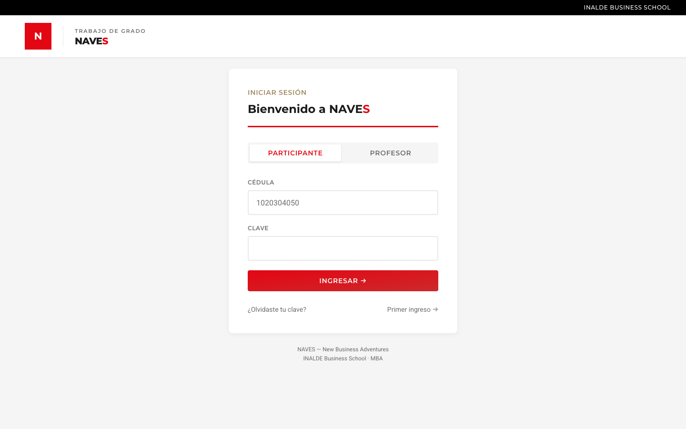

- **Tab "Participante"** → ingresa con tu **cédula** (solo dígitos) y clave.
- **Tab "Profesor"** → ingresa con tu **email institucional** y clave.

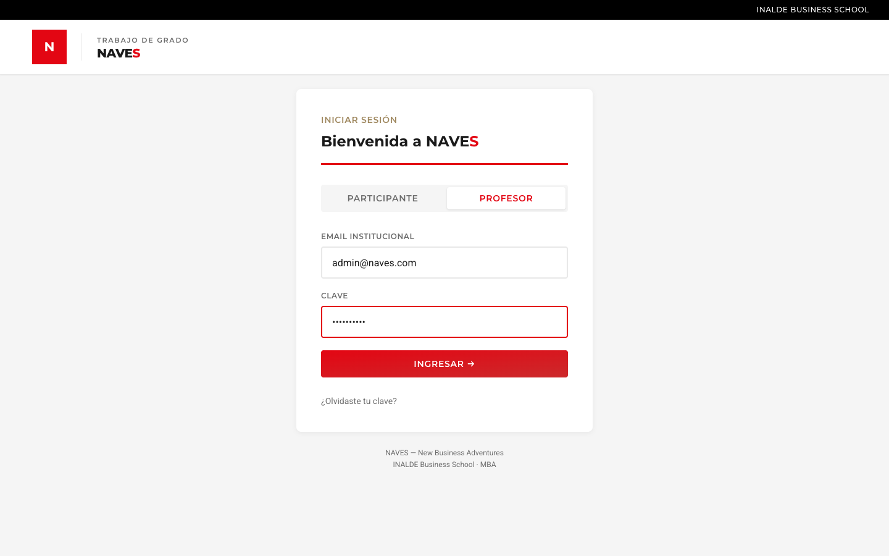

> **Importante para participantes:** tu cédula debe haber sido cargada previamente por el super administrador desde el panel "Cargar participantes". Si recibes el error *"Tu cédula no está registrada"*, contacta al administrador del programa.

---

## 2. Recuperación de clave

Si olvidaste tu clave, click en **"¿Olvidaste tu clave?"** desde el login:

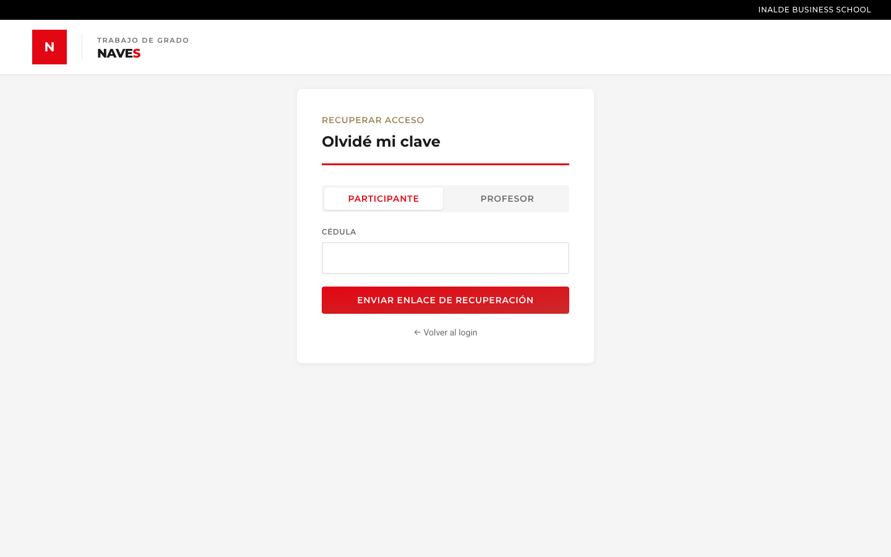

1. Selecciona el tab que aplique (Participante = cédula, Profesor = email).
2. Ingresa tu identificador y click **"Enviar enlace de recuperación"**.
3. Recibirás un email **en tu correo institucional real** con un enlace de un solo uso (válido 30 minutos).

> El sistema responde con un mensaje neutro independientemente de si el usuario existe o no, para evitar filtrar información.

Al hacer clic en el enlace del email, llegas a la pantalla de creación de nueva clave:

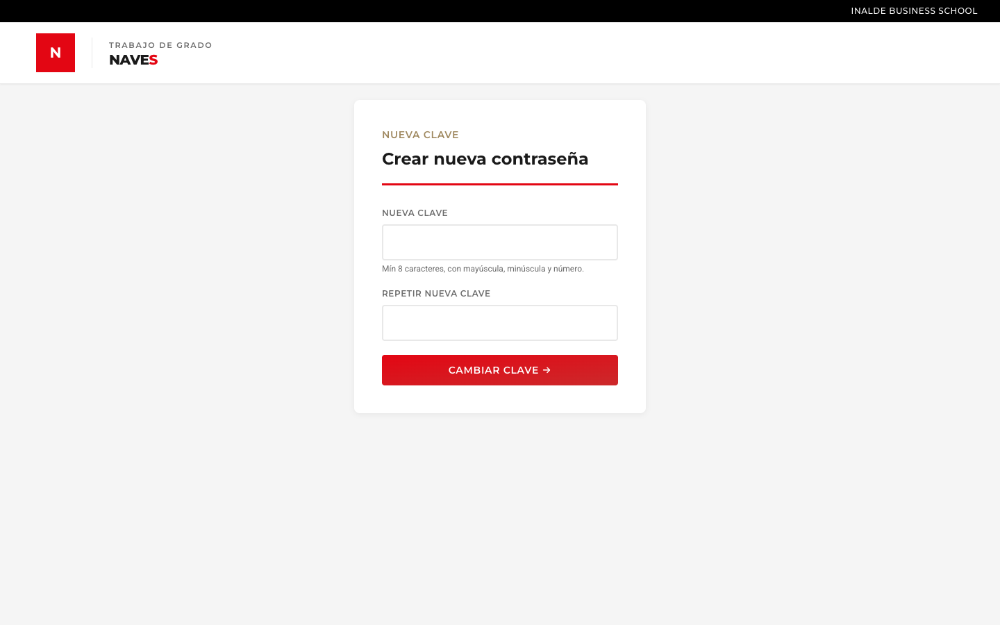

**Reglas de la clave:** mínimo 8 caracteres, al menos una mayúscula, una minúscula y un número.

---

## 3. Manual del Administrador

### 3.1 Dashboard general

Al entrar como administrador, ves una sola opción que conduce al panel completo:

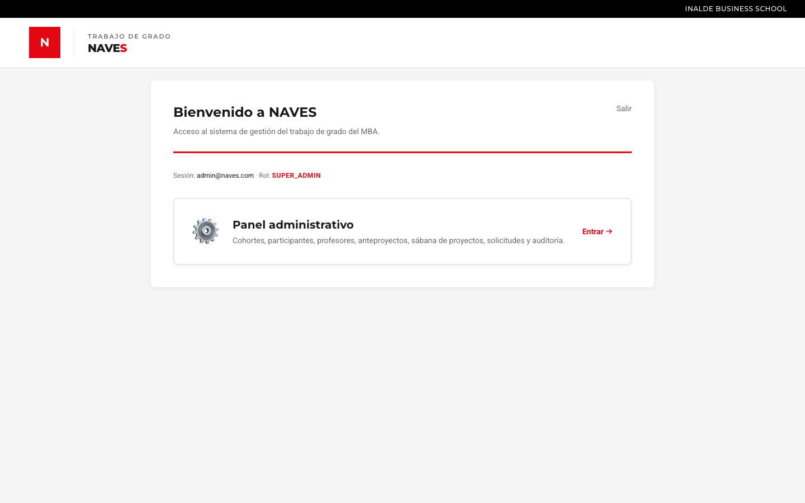

Tu rol aparece marcado como **`ADMINISTRADOR`** en color rojo, bajo el email de la sesión.

### 3.2 Panel administrativo

El panel agrupa **8 módulos independientes**, cada uno con su acción específica:

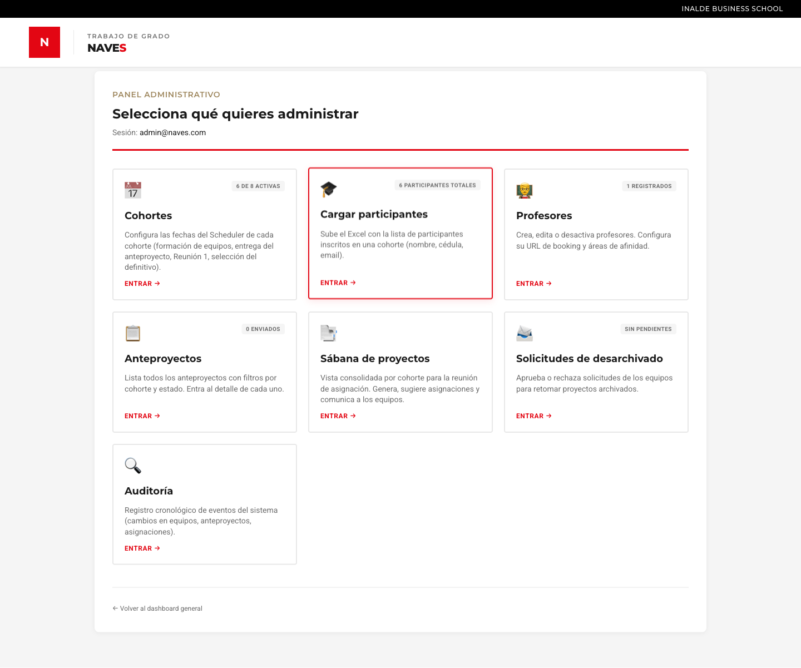

Cada card muestra un **hint contextual** en la esquina superior derecha (por ejemplo "6 de 8 activas" en Cohortes, "⚠ 2 pendientes" en Solicitudes si las hay). Las cards con alertas se resaltan en rojo.

Los 8 módulos son: **Cohortes**, **Cargar participantes**, **Profesores**, **Anteproyectos**, **Sábana de proyectos**, **Solicitudes de desarchivado**, **Roles y permisos** (sección 3.10) y **Auditoría**.

Al entrar a cualquier módulo, en la parte superior tienes el breadcrumb **`← Panel administrativo / <módulo>`** que te permite volver atrás cuando termines.

### 3.3 Cohortes — fechas del Scheduler

Las cohortes están pre-cargadas (las 8 cohortes del MBA: INT/FS · 24-26, 26-28, 27-29, 28-30). Aquí configuras las **fechas críticas** que el sistema usa para bloquear acciones.

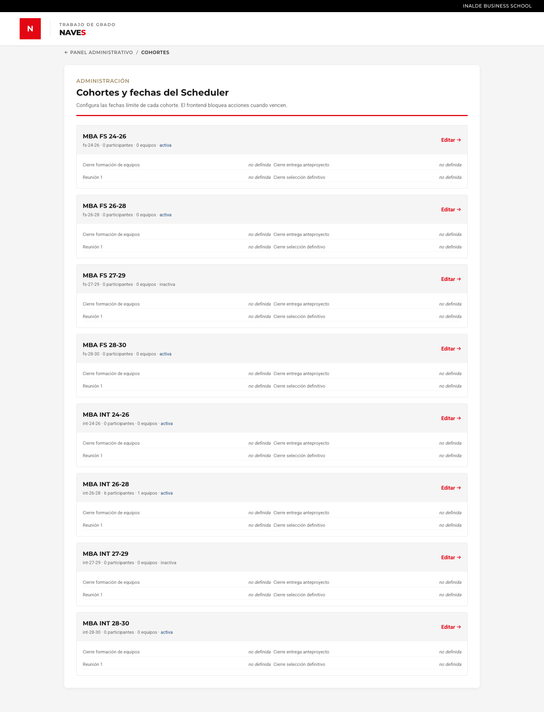

**Fechas que debes configurar por cohorte:**

| Fecha | Para qué sirve |
|---|---|
| **Cierre formación de equipos** | Hasta cuándo los participantes pueden crear/modificar equipos |
| **Cierre entrega anteproyecto** | Hasta cuándo se puede editar y enviar el anteproyecto |
| **Reunión 1** | Fecha desde la que el equipo puede marcar "Reunión 1 hecha" para empezar la selección del proyecto definitivo |
| **Cierre selección definitivo** | Hasta cuándo se debe seleccionar el proyecto definitivo |

Click **"Editar →"** en cualquier cohorte abre el modo edición:

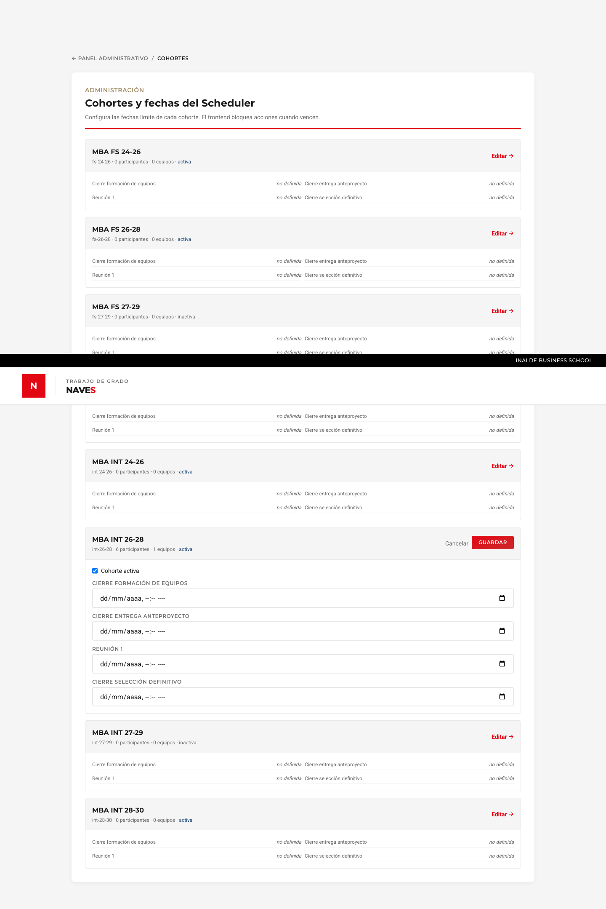

- Marca/desmarca **"Cohorte activa"** para habilitar/deshabilitar.
- Las fechas usan formato local con calendario y hora.
- Click **"Guardar"** para persistir o **"Cancelar"** para descartar.

> El frontend bloquea las acciones del participante automáticamente cuando vence cada fecha; no necesitas hacer nada más.

### 3.4 Cargar participantes (lista por cohorte)

Sube la lista de inscritos del MBA en formato Excel (.xlsx).

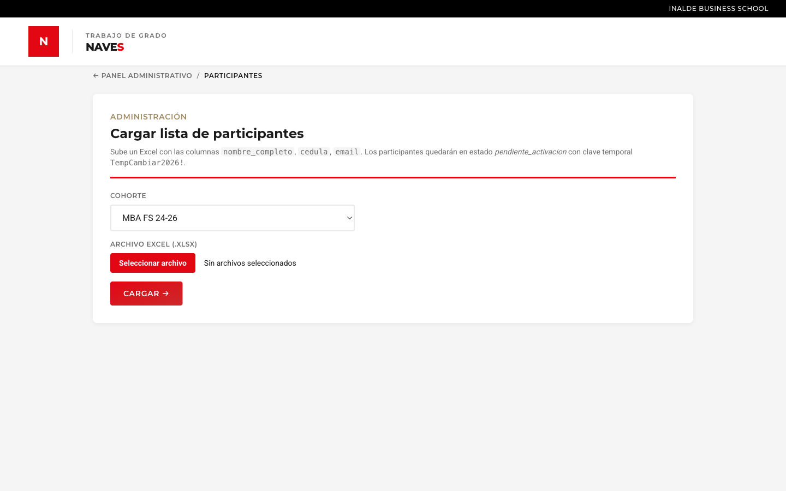

**Pasos:**
1. Selecciona la **cohorte** destino del dropdown.
2. Click **"Seleccionar archivo"** → elige tu `.xlsx`.
3. Click **"Cargar →"**.

**Formato esperado del Excel** (3 columnas obligatorias en la fila 1):

| nombre_completo | cedula | email |
|---|---|---|
| Juan Pérez Mendoza | 1010101010 | juan.perez@inalde.edu.co |
| María González Ruiz | 1010101011 | maria.gonzalez@inalde.edu.co |

El sistema:
- Crea un usuario en Supabase Auth con email sintético (la cédula nunca se expone).
- Encripta cédula y email con AES-256.
- Marca cada participante como **`pendiente_activacion`** con clave temporal **`TempCambiar2026!`**.
- Los participantes deben usar **"¿Olvidaste tu clave?"** para definir su clave real (que activa el usuario).

Al final verás un resumen con cantidad de filas insertadas y errores por fila si los hubo.

### 3.5 Profesores — gestión de cuentas

Lista de profesores activos del programa. Distingue **Administrador** (rojo) de **Profesor** (gris).

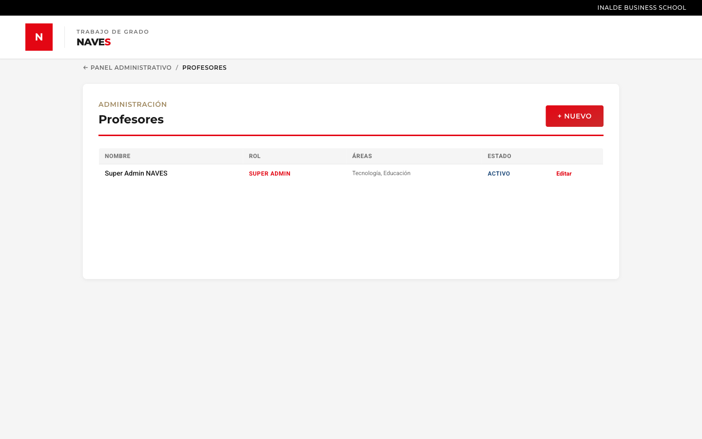

**Crear nuevo profesor** → click **"+ Nuevo"**:

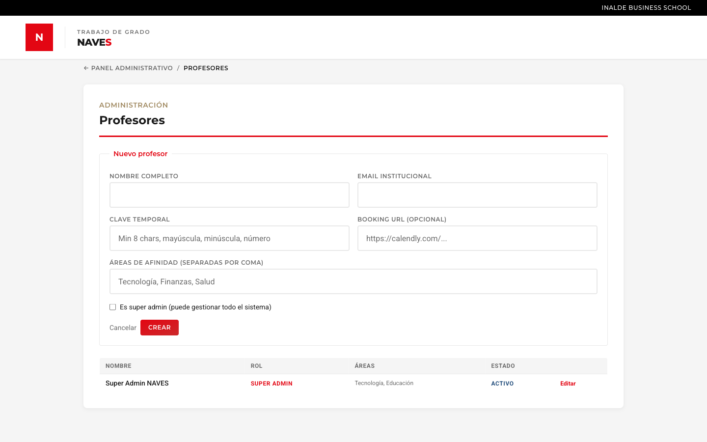

Campos:
- **Nombre completo**, **Email institucional**, **Clave temporal** (el profesor podrá cambiarla con recovery)
- **Booking URL** (Calendly, Cal.com, etc.) — opcional, aparece al equipo cuando se asigna profesor
- **Áreas de afinidad** (ej. "Tecnología, Salud digital, Finanzas") — el algoritmo de sugerencia usa estas para recomendar asignaciones
- Checkbox **"Es administrador (puede gestionar todo el sistema)"** — marca solo si quieres que el nuevo profesor tenga permisos administrativos completos

Al crear, queda registrado en la lista:

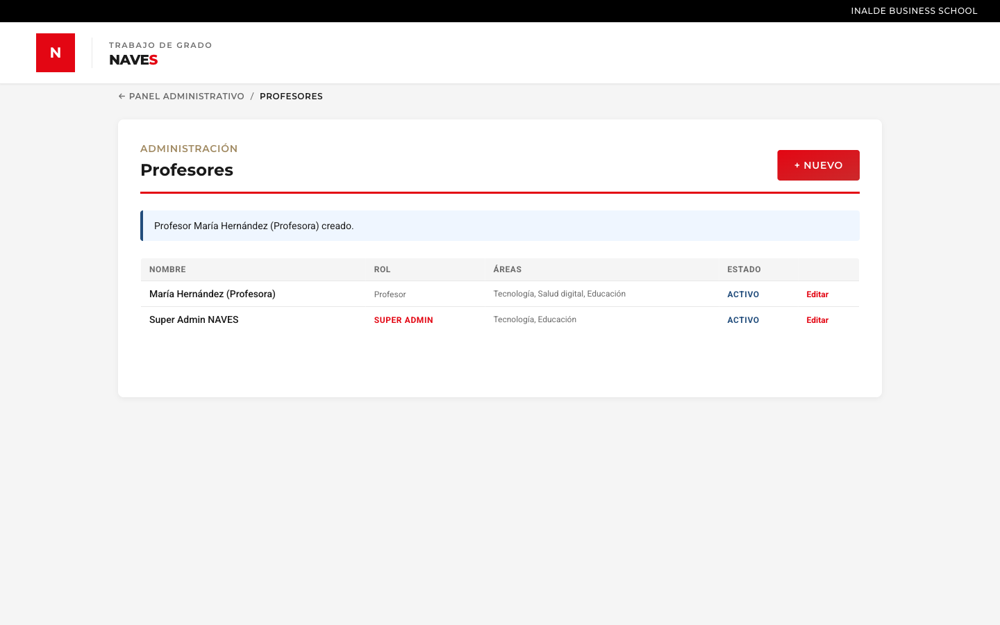

**Editar:** click "Editar" en cualquier fila para cambiar nombre, áreas, activar/desactivar o promover a administrador.

> Para asignaciones de permisos más granulares (no necesariamente "administrador completo"), usa el módulo **Roles y permisos** descrito en la sección 3.10.

### 3.6 Anteproyectos — todos los enviados

Lista todos los anteproyectos con filtros por **cohorte** y **estado** (borrador/enviado/revisado/aprobado):

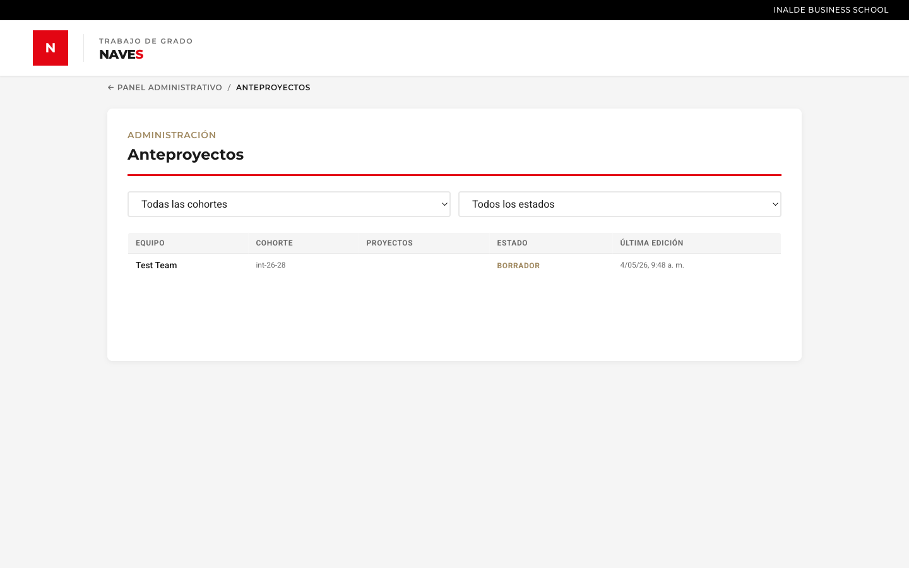

**Estados:**
- 🟡 **Borrador** — el equipo aún está editando
- 🔵 **Enviado** — el equipo ya envió, esperando revisión/Reunión 1
- 🔴 **Revisado / Aprobado** — pasos posteriores del proceso

Click en cualquier fila abre el detalle completo:

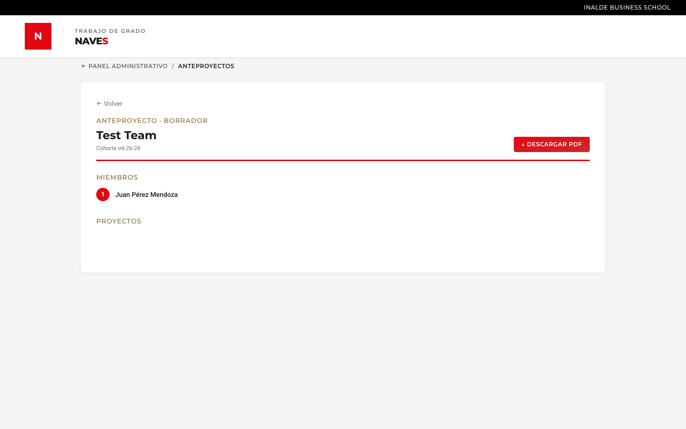

Muestra:
- Equipo, miembros con su perfil (emprendedor/directivo/ambos)
- Cada proyecto con su Canvas del negocio (8 campos: cliente, canales, relaciones, ingresos, recursos, actividades, socios, costos)
- Cronograma con hitos (5–10 por proyecto)
- Estado de cada proyecto: **DEFINITIVO** (rojo), **ARCHIVADO** (tachado), o pendiente

Botón **"↓ Descargar PDF"** arriba a la derecha genera un PDF con identidad INALDE listo para imprimir o compartir.

### 3.7 Sábana de proyectos

La **sábana** es la vista consolidada de todos los proyectos enviados de una cohorte, diseñada para la **reunión de asignación de profesores**.

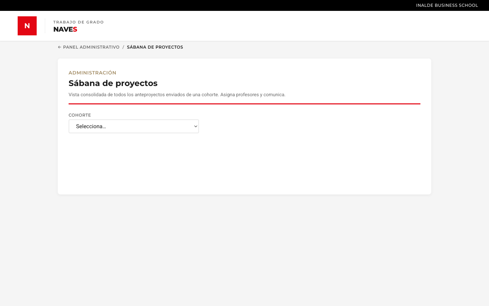

**Flujo completo:**

1. **Selecciona la cohorte** del dropdown.

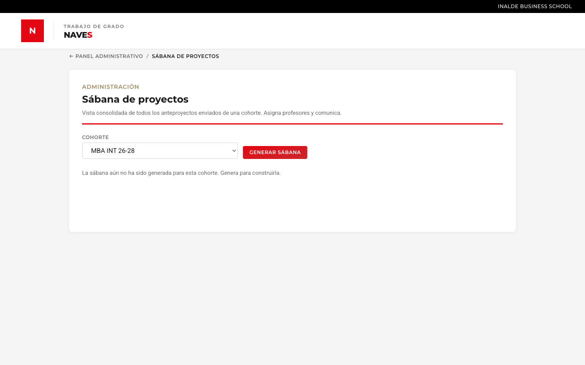

2. Click **"Generar sábana"** — el sistema toma snapshot de todos los anteproyectos enviados con sus proyectos, equipos, miembros y resumen.

3. (Opcional) Click **"Sugerir asignaciones"** — el algoritmo empareja profesores con proyectos según afinidad (sector + CIIU vs `areas_afinidad` del profesor). Aplica solo a equipos sin asignación previa.

4. **Ajusta manualmente** las asignaciones con el dropdown de cada equipo (puedes sobreescribir las sugerencias).

5. Click **"Guardar asignaciones"** — registra la asignación profesor↔equipo en la base.

6. Click **"↓ PDF"** — descarga el PDF horizontal con todos los equipos agrupados (ideal para imprimir y llevar a la reunión).

7. Click **"Comunicar →"** — marca la sábana como comunicada y dispara el envío de notificación a los equipos (pendiente que el SMTP esté configurado).

**Estados de la sábana:**
- `generada` → snapshot listo
- `en_revision` → durante la reunión
- `asignada` → asignaciones guardadas
- `comunicada` → notificación enviada

### 3.8 Solicitudes de desarchivado

Cuando un equipo elige el proyecto definitivo, los demás quedan archivados. Si después quieren retomar uno archivado, deben enviar una **solicitud con motivo** que tú apruebas o rechazas.

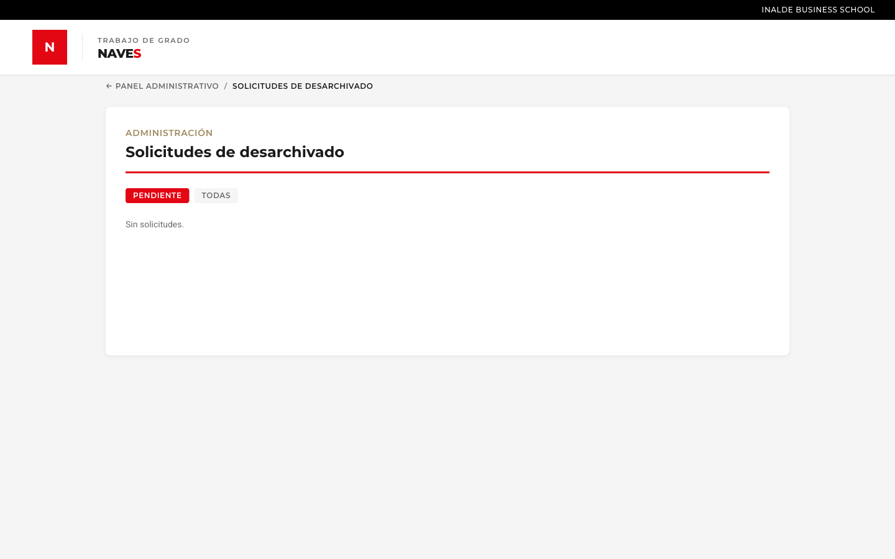

- Tab **"Pendiente"** muestra solo las que requieren acción.
- Tab **"Todas"** incluye aprobadas y rechazadas históricas.
- Cada solicitud muestra: proyecto, equipo solicitante, fecha, **motivo escrito por el equipo**.

Para resolver:
1. Lee el motivo.
2. (Opcional) Escribe una **respuesta** que el equipo verá.
3. Click **"Aprobar"** (revierte el proyecto a `pendiente_seleccion` para que puedan retomarlo) o **"Rechazar"**.

### 3.9 Auditoría

Registro cronológico de todos los eventos del sistema:

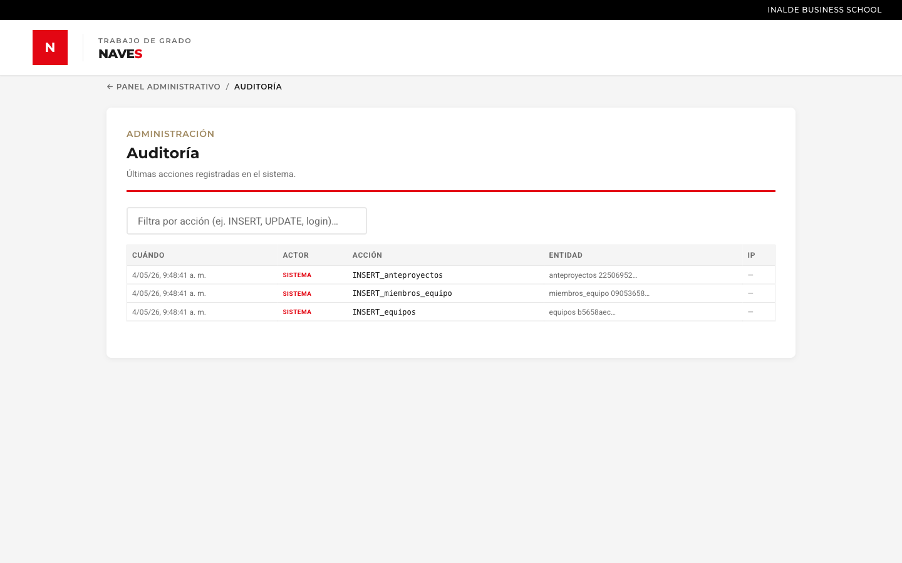

**Columnas:**
- **Cuándo** — timestamp del evento
- **Actor** — tipo (sistema/participante/profesor/administrador) + UUID truncado
- **Acción** — `INSERT_anteproyectos`, `UPDATE_equipos`, `DELETE_proyectos`, etc.
- **Entidad** — tabla y ID afectado
- **IP** — IP de origen (si aplica)

El campo **"Filtra por acción"** acepta búsqueda parcial (ej. `INSERT`, `equipo`, `login`).

> Cualquier cambio en equipos, anteproyectos, proyectos, miembros, asignaciones o solicitudes queda registrado automáticamente vía triggers de Postgres.

### 3.10 Roles y permisos (RBAC granular)

NAVES incluye un sistema de **roles y permisos atómicos** (RBAC = Role-Based Access Control) que permite ir más allá del binario "Administrador / Profesor / Participante" y dar permisos puntuales a usuarios específicos.

> ¿Cuándo usar este módulo? Cuando quieras dar acceso parcial: por ejemplo un profesor que pueda ver la **Sábana** pero no editar **Cohortes**, o un asistente académico que solo pueda **descargar PDFs de anteproyectos** sin entrar a Auditoría.

> *(Captura del módulo "Roles y permisos" pendiente — se incorporará en la siguiente revisión del manual.)*

El módulo se divide en dos pestañas:

#### Pestaña "Roles"

Lista todos los roles definidos. Por defecto el sistema trae **3 roles del sistema** (no se pueden borrar):

| Rol del sistema | Permisos por defecto |
|---|---|
| `super_admin` | 17 permisos: gestión completa de cohortes, participantes, profesores, anteproyectos, sábana, solicitudes, auditoría, roles |
| `profesor` | 6 permisos: ver anteproyectos asignados, leer y descargar sábana, gestionar solicitudes |
| `participante` | 4 permisos: ver y editar su anteproyecto, ver su profesor, gestionar su equipo |

Botón **"+ Nuevo rol"** abre un modal donde defines:
- **Código** (slug técnico, ej. `coordinador_academico`) y **Nombre legible** (ej. "Coordinador Académico")
- **Descripción**
- **Permisos** — checkboxes agrupados por categoría (Cohortes, Participantes, Profesores, Anteproyectos, Sábana, Solicitudes, Auditoría, Meta, Participante)

> *(Captura del modal de edición de rol pendiente — se incorporará en la siguiente revisión.)*

Cada permiso se muestra con su **descripción legible** (ej. "Ver listado de cohortes y sus fechas") en lugar del código técnico interno (`cohortes:read`).

> Click **"Editar"** en un rol del sistema te permite **agregar permisos extra** pero no quitar los esenciales. Click "Editar" en un rol custom te permite cambiar todo. **"Eliminar"** solo aparece para roles custom.

#### Pestaña "Asignar a usuarios"

> *(Captura de la pestaña "Asignar a usuarios" pendiente — se incorporará en la siguiente revisión.)*

Aquí asignas roles a usuarios concretos:
1. Busca al profesor o participante por nombre/email.
2. Selecciona uno o varios roles del listado.
3. Opcionalmente puedes asignar **permisos individuales** (sin pasar por un rol) — útil para excepciones puntuales.
4. Click **"Guardar asignaciones"**.

> Los cambios surten efecto inmediato (con una pequeña caché de hasta 60 segundos por sesión activa). Si necesitas que un usuario vea el cambio antes, pídele que cierre y vuelva a abrir sesión.

#### ¿Cómo encajan estos permisos con el checkbox "Es administrador" del módulo Profesores?

- Marcar un profesor como **"Es administrador"** equivale a darle el rol `super_admin` automáticamente. Es el atajo más rápido cuando quieres delegación total.
- Cuando NO quieras delegación total, deja el checkbox sin marcar y entra a **Roles y permisos** para dar permisos puntuales.

---

## 4. Manual del Profesor

Cuando entras como profesor regular (sin permisos de administrador), tu dashboard muestra **3 atajos** directos a tus tareas principales:

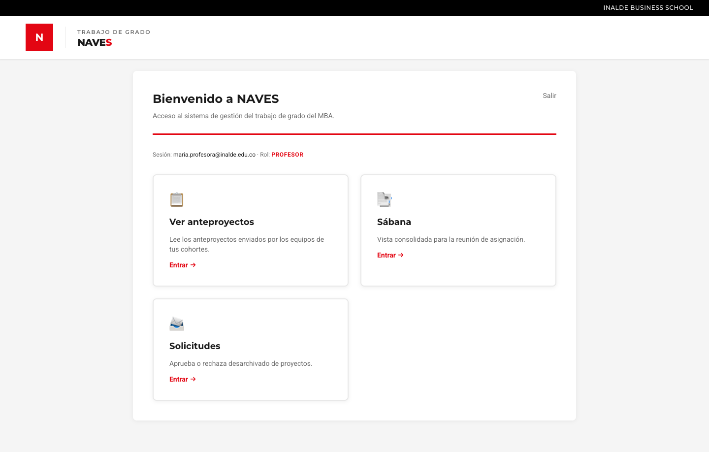

Tu rol aparece como **`PROFESOR`** y solo verás 3 cards:

### 4.1 Ver anteproyectos

Mismo listado y detalle que ve el administrador (sección 3.6), filtrado por cohortes asignadas a ti. Puedes leer cualquier anteproyecto enviado y **descargar el PDF** desde el botón **"↓ Descargar PDF"** del detalle.

### 4.2 Sábana

Lectura de la sábana consolidada (sección 3.7). Puedes consultar, **descargar el PDF**, ver asignaciones, pero **no editas** (la asignación final la guarda el administrador).

### 4.3 Solicitudes

Idéntico al panel del administrador (sección 3.8). Puedes aprobar o rechazar solicitudes de desarchivado de los equipos asignados a ti.

> **Diferencia con el administrador:** no ves los módulos de Cohortes, Cargar participantes, Profesores, Roles y permisos ni Auditoría. Esos son responsabilidad del administrador del programa (a menos que se te haya otorgado un permiso puntual desde el módulo de Roles y permisos — ver sección 3.10).

---

## 5. Manual del Participante (estudiante)

### 5.1 Dashboard

Tu pantalla principal organiza tus tareas en 4 cards:

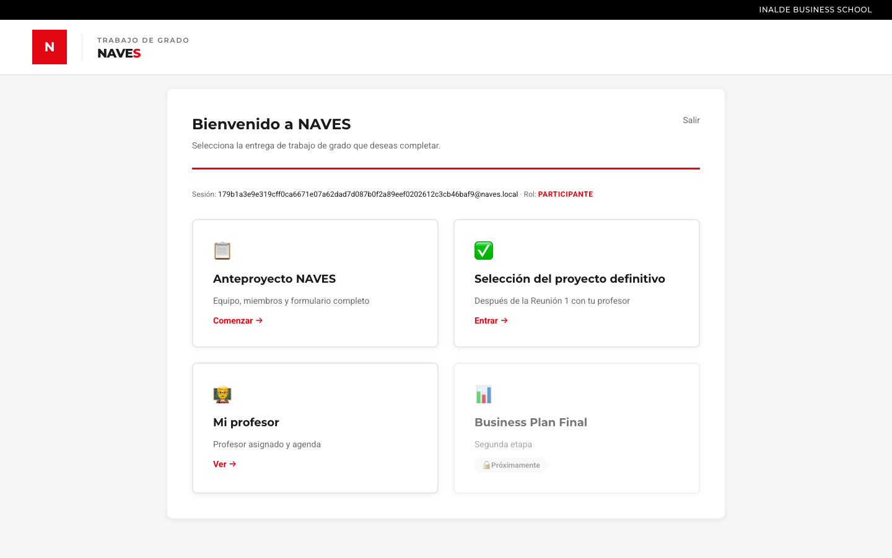

| Card | Cuándo entrar |
|---|---|
| 📋 **Anteproyecto NAVES** | Crear equipo y completar el formulario |
| ✅ **Selección del proyecto definitivo** | Después de la Reunión 1 con tu profesor |
| 👨‍🏫 **Mi profesor** | Ver el profesor asignado y agendar reuniones |
| 📊 **Business Plan Final** | Próximamente (segunda etapa del trabajo de grado) |

> Tu sesión muestra un email "sintético" largo — eso es normal: tu cédula se convierte internamente a un identificador único. Nadie más lo ve.

### 5.2 Crear y gestionar tu equipo

Click **"Anteproyecto NAVES"** te lleva primero a la gestión de equipo (tienes que tener equipo antes de llenar el formulario).

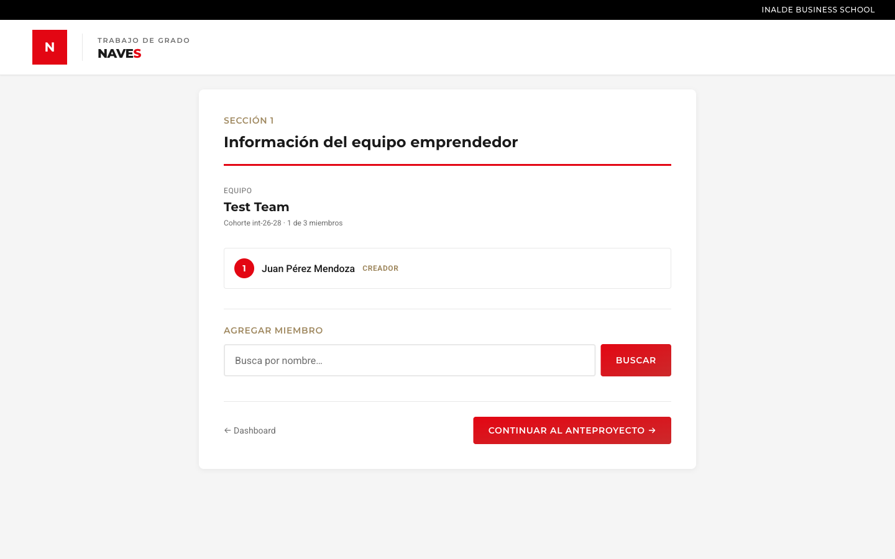

**Si aún no tienes equipo:** te aparecerá un botón **"Crear mi equipo"** con campo opcional para el nombre. La cohorte la asigna automáticamente el sistema (la que cargó el administrador con tu cédula).

**Si ya tienes equipo:**
- Ves la lista de miembros con su posición (1, 2, 3) y el creador marcado en dorado.
- Equipos de **1, 2 o 3 personas** (el creador + hasta 2 más).
- Para agregar miembros: escribe el nombre en el **buscador inteligente en vivo** — los resultados aparecen automáticamente mientras escribes (con un retraso de ~250 ms). No hay botón "Buscar"; basta con escribir.

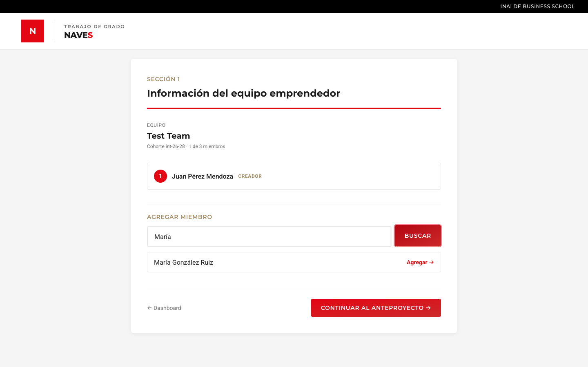

> El buscador solo muestra participantes de **tu misma cohorte** que aún **no están en otro equipo**. Click **"Agregar"** en el resultado deseado y el miembro queda añadido al equipo.

Click **"Continuar al anteproyecto →"** te lleva al formulario.

### 5.3 Formulario del anteproyecto

El formulario está optimizado para escritura cómoda: usa un **ancho de hasta 1100 px** y aprovecha la pantalla para mostrar varios bloques en paralelo donde tiene sentido.

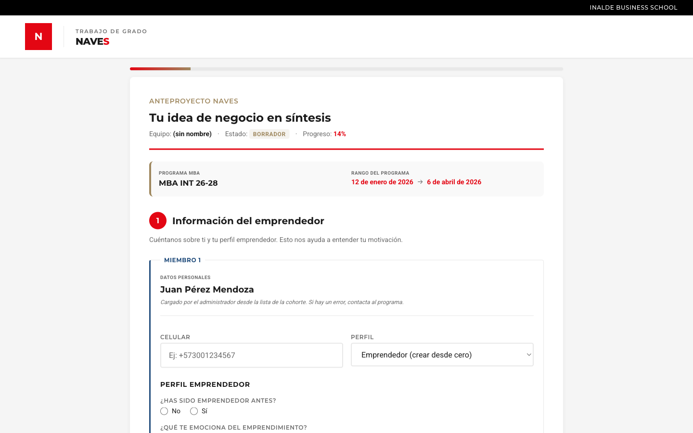

En el encabezado superior verás el **nombre de tu cohorte** (ej. "MBA INT 26-28") y las **fechas críticas** que aplican: cierre de entrega del anteproyecto, Reunión 1 y selección definitivo. Esto te ayuda a saber cuánto tiempo te queda sin tener que preguntar.

El formulario tiene **2 secciones principales**:

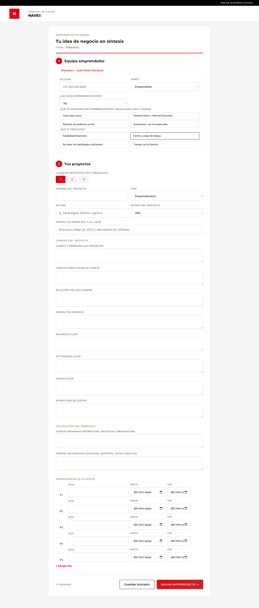

#### Sección 1 — Equipo emprendedor

Por cada miembro completas:
- **Celular** (formato +57…)
- **Perfil** — Emprendedor / Directivo / Ambos
- **¿Has sido emprendedor antes?** Sí/No
  - Si "Sí" → ¿Quebró tu emprendimiento? (Sí/No/N.A.) → si quebró: aprendizajes (máx 300 chars)
- **¿Qué te emociona del emprendimiento?** — selección múltiple (crear, dinero, problema social, autonomía)
- **¿Qué te preocupa?** — selección múltiple (financiera, estrés, habilidades, familia)

#### Sección 2 — Tus proyectos

- Selector **1, 2 o 3 proyectos** — define cuántas alternativas vas a presentar.
- Si tienes más de uno aparecen **pestañas dinámicas**, una por proyecto.
- Por cada proyecto:
  - **Nombre, Tipo** (emprendimiento/intraemprendimiento), **Sector**
  - **Estado del proyecto** (idea/investigación/prototipo/validación)
  - **Código CIIU** con autocompletado:

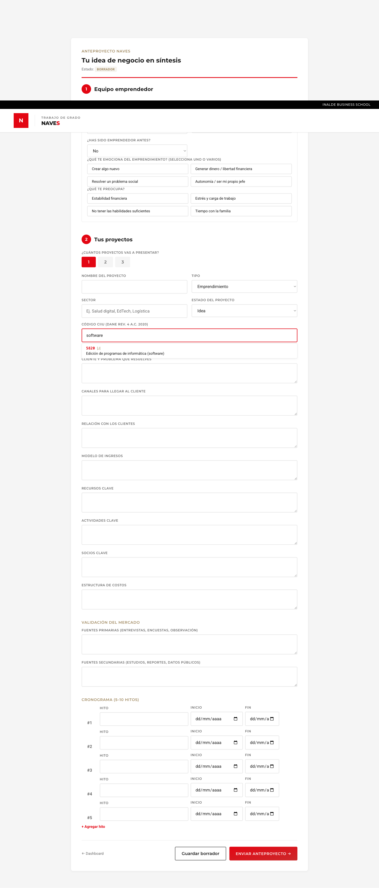

  > Escribe el código (ej. `6201`) o palabras clave (ej. `software`, `educacion`, `restaurante`). El selector usa búsqueda inteligente que ignora tildes.

  - **Canvas del negocio** — los 8 bloques se distribuyen en pantalla así:
    - **"Cliente y problema"** ocupa el ancho completo (es el bloque más importante).
    - Los otros 7 (canales, relaciones, ingresos, recursos, actividades, socios, costos) se muestran en **dos columnas** para aprovechar el ancho de la pantalla y permitirte ver varios bloques a la vez sin tanto scroll.

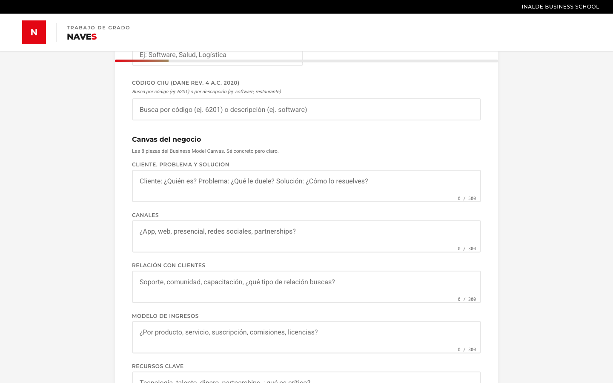

  - **Validación del mercado**: fuentes primarias y secundarias.
  - **Cronograma de hitos** — empieza con **un solo hito visible**. A medida que escribes la descripción del último hito, el sistema **auto-genera** automáticamente el siguiente vacío (hasta un máximo de 10). Así no te abruma una lista vacía gigante: vas llenando uno a la vez y aparecen los que necesites.

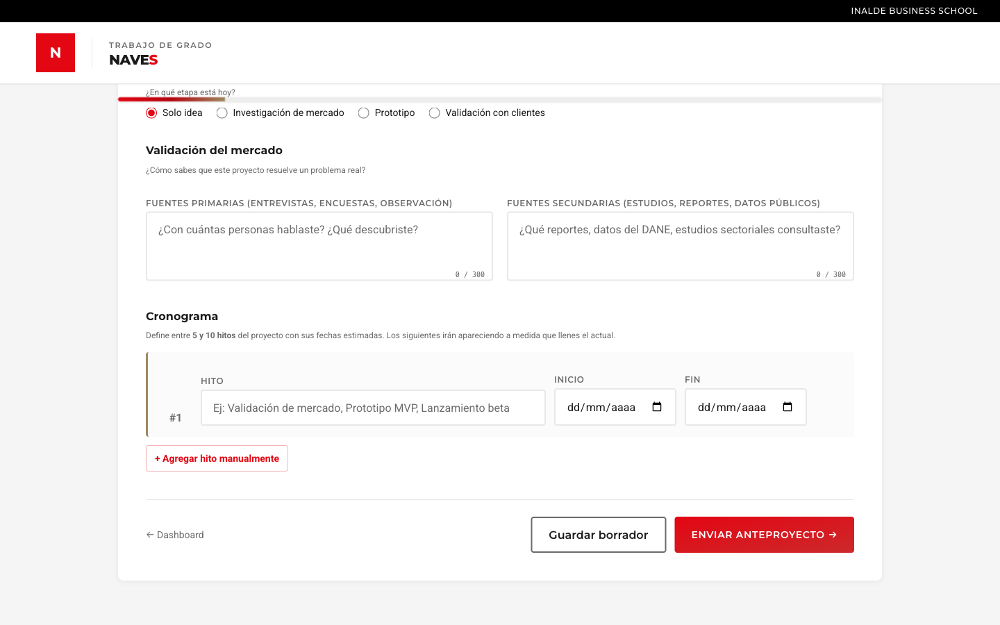

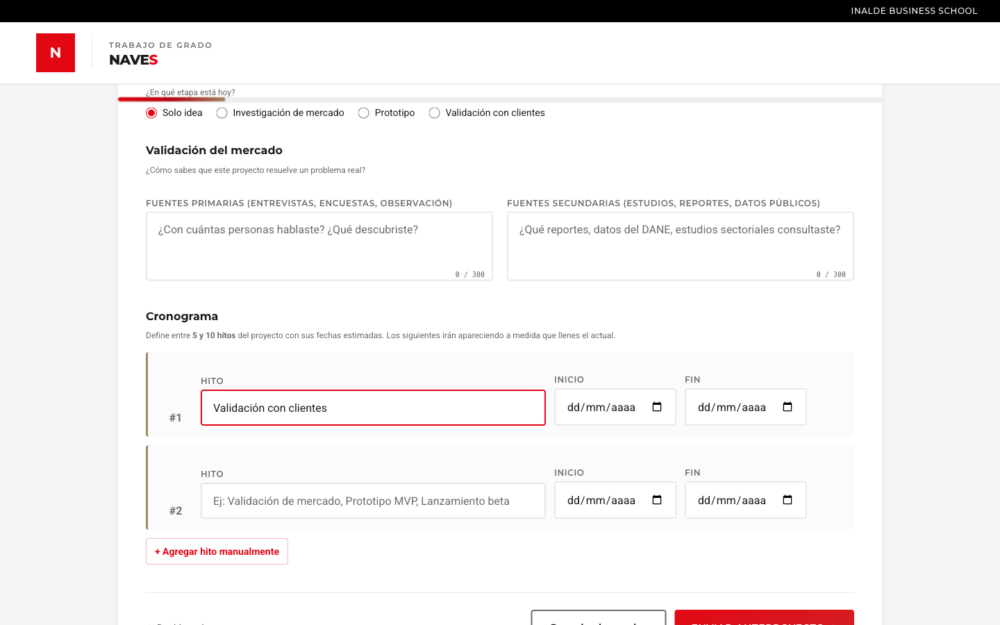

  > Cada hito tiene **descripción**, **fecha de inicio** y **fecha de fin**. El cronograma final debe tener al menos varios hitos completos antes de poder enviar el anteproyecto.

#### Botones de acción (al final)

- **"Guardar borrador"** — persiste tu progreso. Puedes volver más tarde.
- **"Enviar anteproyecto →"** — confirmación obligatoria. **¡Una vez enviado, no se puede editar!**
- Una vez enviado, aparece también un botón **"↓ Descargar PDF"** que genera tu anteproyecto en un PDF con identidad INALDE listo para imprimir o compartir con tu profesor.

> **Caso especial:** si solo enviaste 1 proyecto, este se marca **automáticamente como definitivo** al enviar (no necesitas pasar por la sección 3).

### 5.4 Selección del proyecto definitivo (post-Reunión 1)

Si enviaste **2 o 3 proyectos**, después de la **Reunión 1** con tu profesor debes elegir uno como definitivo. El resto quedan archivados.

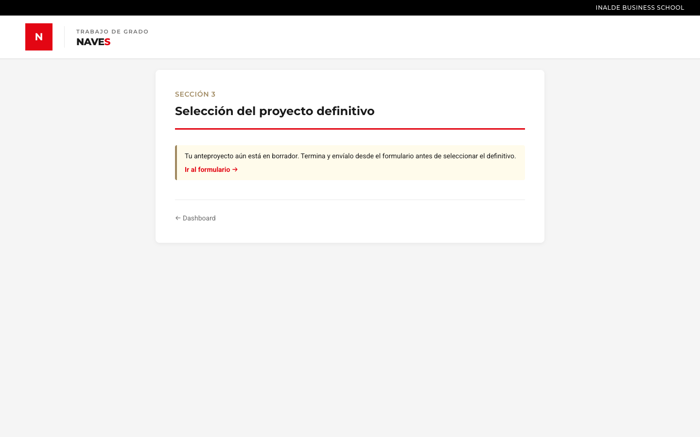

**La pantalla se adapta según tu estado actual:**

| Estado | Qué ves |
|---|---|
| Anteproyecto en borrador | Aviso amarillo: "Termina y envía el anteproyecto antes de seleccionar". |
| 1 solo proyecto | Aviso azul: "Tu proyecto único ya quedó marcado como definitivo automáticamente." |
| 2-3 proyectos sin Reunión 1 marcada | Botón "Confirmo que ya tuvimos la Reunión 1". |
| Reunión 1 marcada, pendiente seleccionar | Lista de proyectos con radio buttons + "Confirmar proyecto definitivo →". |
| Ya seleccionado | Recuadro rojo con el proyecto definitivo + lista de archivados con botón "Solicitar desarchivar". |

**Cómo funciona la selección:**
1. Click en el botón "Confirmo que ya tuvimos la Reunión 1" — solo disponible **a partir de la fecha de Reunión 1** establecida por el admin.
2. Aparecen tus proyectos con radio buttons. Selecciona uno.
3. Click **"Confirmar proyecto definitivo"** → confirmación con advertencia.
4. El proyecto elegido pasa a **DEFINITIVO** y queda congelado (no editable). Los demás pasan a **ARCHIVADO**.

**Solicitar desarchivar:** Si más adelante quieren retomar un proyecto archivado, click **"Solicitar desarchivar"** → escribe un motivo (mín 20 caracteres) → el profesor lo revisa y aprueba/rechaza.

### 5.5 Mi profesor asignado

Después de la reunión de asignación de profesores, podrás ver aquí quién es tu profesor y agendar tus reuniones:

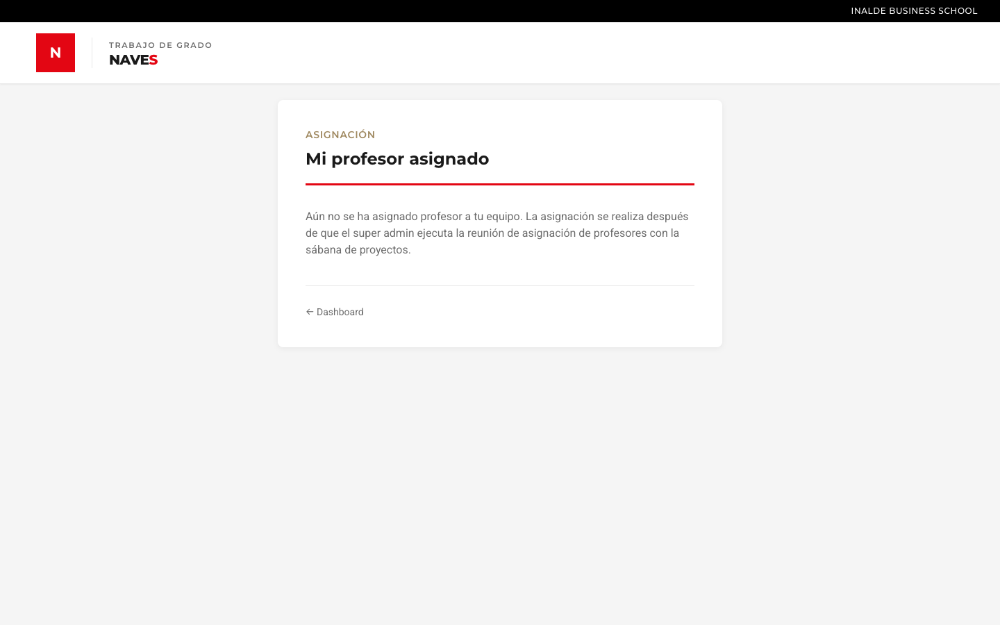

**Si aún no hay asignación:** mensaje informativo. La asignación ocurre cuando el administrador completa la sábana de proyectos y la marca como "comunicada".

**Una vez asignado verás:**
- Nombre completo del profesor
- Áreas de afinidad
- Botón **"Agendar reunión →"** que te lleva a su link de booking (Calendly, Cal.com, etc.)
- Fecha en que se realizó la asignación

---

## 6. Glosario

| Término | Significado |
|---|---|
| **Anteproyecto** | Documento que entrega el equipo con 1, 2 o 3 alternativas de proyecto |
| **Proyecto definitivo** | El proyecto elegido por el equipo después de la Reunión 1 |
| **Proyecto archivado** | Proyecto descartado al elegir el definitivo. Puede desarchivarse con aprobación del profesor |
| **Cohorte** | Grupo del MBA (ej. "MBA INT 26-28" = Intensivo 2026-2028) |
| **Cédula sintética** | Email interno construido a partir del hash de la cédula. Solo lo usa el sistema, el participante nunca lo ve |
| **CIIU** | Clasificación Industrial Internacional Uniforme (DANE Rev. 4 A.C. 2020). 499 clases para clasificar tu actividad económica |
| **Canvas del negocio** | 8 elementos clave del modelo: cliente/problema, canales, relaciones, ingresos, recursos, actividades, socios, costos |
| **Sábana de proyectos** | Vista consolidada de todos los proyectos de una cohorte. Sirve para la reunión de asignación de profesores |
| **NAVES Scheduler** | El conjunto de fechas críticas de cada cohorte (formación equipos, entrega anteproyecto, Reunión 1, selección definitivo) |
| **Administrador** | Profesor con permisos extendidos para administrar todo el sistema. En la base de datos se identifica con el rol técnico `super_admin` |
| **Roles y permisos (RBAC)** | Sistema granular para asignar permisos atómicos (ej. "ver sábana", "descargar PDF de anteproyecto") a usuarios específicos sin necesidad de hacerlos administradores completos |

---

**Soporte:** Para problemas técnicos o solicitudes de cambio, contacta al administrador del programa MBA NAVES en INALDE Business School.

**NAVES — New Business Adventures · INALDE Business School · MBA**
